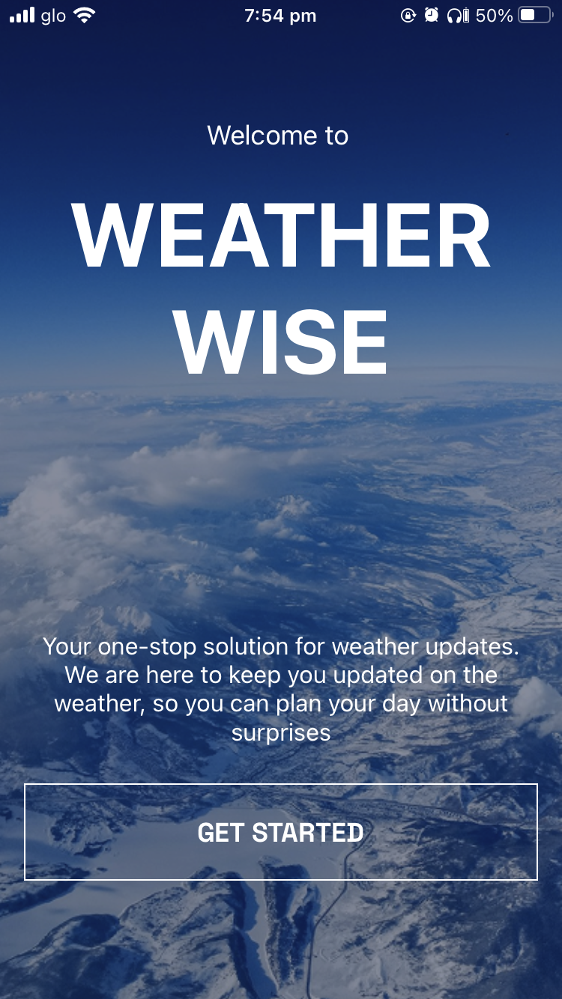
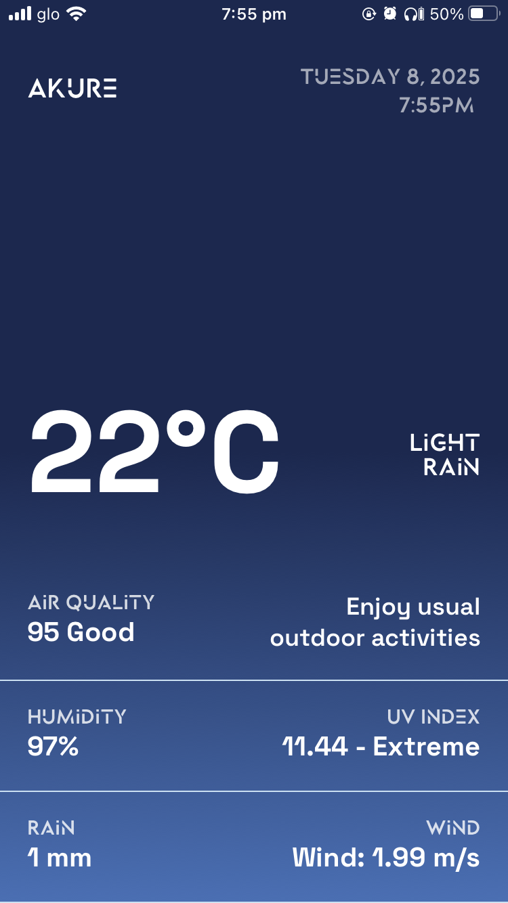

# 🌤️ WeatherWise - Modern Weather App

[](https://choosealicense.com/licenses/mit/)
[](https://reactnative.dev/)
[](https://expo.dev/)
[](https://developer.mozilla.org/en-US/docs/Web/JavaScript)

A beautiful, feature-rich weather application built with React Native and Expo, showcasing modern mobile development practices and stunning UI design.

## 🎯 **Overview**

WeatherWise delivers real-time weather information with a sleek, intuitive interface that adapts to time of day and weather conditions. Built to demonstrate advanced React Native skills and modern app development practices.

## 🎬 **Demo**

### 📱 **Live Demo**
> **[Try it on Expo](https://expo.dev/preview/update?message=weather+app+first+release&updateRuntimeVersion=1.0.0&createdAt=2025-07-08T18%3A43%3A15.338Z&slug=exp&projectId=65a6a591-1aec-4aec-8f3d-a924e42aa3d2&group=5c2bbcef-2772-4128-b0ca-b41661a959e0)** - Scan QR code with Expo Go app


## ✨ **Features**

### 🌟 **Core Functionality**
- **Real-time Weather Data** - Current conditions, temperature, and forecasts
- **Location-based Services** - Automatic location detection with user permission
- **Dynamic UI** - Gradient backgrounds that change based on time of day
- **Responsive Layout** - Optimized for all screen sizes

### 🎨 **UI/UX Highlights**
- **Time-aware Gradients** - Morning, afternoon, evening, and night themes
- **Smooth Animations** - Subtle transitions and loading states
- **Clean Typography** - Carefully chosen fonts and spacing
- **Intuitive Navigation** - Simple, user-friendly interface
- **Error Handling** - Graceful error states and loading indicators

### 📱 **Technical Features**
- **Cross-platform** - Runs on both iOS and Android
- **Expo Integration** - Easy development and deployment
- **API Integration** - OpenWeatherMap API for reliable data
- **Permission Handling** - Proper location permission management
- **Performance Optimized** - Efficient rendering and state management

## 🛠️ **Tech Stack**

### **Frontend**
- **React Native** - Cross-platform mobile development
- **Expo** - Development platform and tools
- **JavaScript/ES6+** - Modern JavaScript features
- **React Hooks** - useState, useEffect for state management

### **Libraries & Dependencies**
- **expo-location** - Location services and permissions
- **expo-linear-gradient** - Beautiful gradient backgrounds
- **react-native-reanimated** - Smooth animations
- **react-native-svg** - Custom icons and graphics

### **API & Services**
- **OpenWeatherMap API** - Weather data provider
- **Geolocation API** - Device location services

## 🚀 **Getting Started**

### **Prerequisites**
- Node.js (v16 or higher)
- Expo CLI
- iOS Simulator or Android Emulator
- OpenWeatherMap API key

### **Installation**

1. **Clone the repository**
```bash
git clone https://github.com/listenexcellence/WeatherWise.git
cd WeatherWise
```

2. **Install dependencies**
```bash
npm install
```

3. **Set up environment variables**
```bash
# Create .env file in root directory
EXPO_PUBLIC_WEATHER_API_KEY=your_openweathermap_api_key_here
```

4. **Start the development server**
```bash
npx expo start
```

5. **Run on device/simulator**
- Scan QR code with Expo Go app (mobile)
- Press 'i' for iOS simulator
- Press 'a' for Android emulator


## 🔧 **API Configuration**

### **Getting OpenWeatherMap API Key**
1. Visit [OpenWeatherMap](https://openweathermap.org/api)
2. Create free account
3. Navigate to API Keys section
4. Copy your API key
5. Add to `.env` file:

```env
EXPO_PUBLIC_WEATHER_API_KEY=your_actual_api_key_here
```

> ⚠️ **Important**: Never commit your API key to version control

## 🎨 **Design Philosophy**

### **Visual Design**
- **Minimalist Approach** - Clean, uncluttered interface
- **Dynamic Theming** - UI adapts to time and weather conditions
- **Glassmorphism** - Modern frosted glass aesthetic
- **Color Psychology** - Warm/cool tones matching weather/time

### **User Experience**
- **Instant Loading** - Fast app startup and data fetching
- **Intuitive Gestures** - Pull-to-refresh and smooth scrolling
- **Accessibility** - Proper contrast and readable text
- **Error Prevention** - Clear error messages and recovery options

## 🔧 **Key Implementation Details**

### **Location Services**
```javascript
// Automatic location detection with permission handling
const { status } = await Location.requestForegroundPermissionsAsync();
const location = await Location.getCurrentPositionAsync({});
```

### **Dynamic Gradients**
```javascript
// Time-based gradient selection
const getGradientColors = () => {
  const hour = new Date().getHours();
  if (hour >= 6 && hour < 12) return ['#FFB347', '#FFCC33']; // Morning
  // ... other time periods
};
```

### **API Integration**
```javascript
// Efficient weather data fetching
const weatherData = await getWeatherData(latitude, longitude);
```

## 📊 **Performance Optimizations**

- **Lazy Loading** - Components load only when needed
- **Efficient API Calls** - Minimized network requests
- **Memory Management** - Proper cleanup of resources
- **Smooth Animations** - 60fps animations using Reanimated

## 🔜 **Future Enhancements**

### **Planned Features**
- [ ] **Hourly Forecast** - 24-hour weather predictions
- [ ] **7-Day Forecast** - Weekly weather outlook
- [ ] **Search Functionality** - Search weather for any city
- [ ] **Favorites** - Save frequently checked locations
- [ ] **Weather Alerts** - Push notifications for severe weather
- [ ] **Dark/Light Mode** - Theme switching
- [ ] **Weather Maps** - Interactive weather visualization
- [ ] **Offline Support** - Cached data for offline viewing

### **Technical Improvements**
- [ ] **TypeScript** - Type safety implementation
- [ ] **Redux/Context** - Advanced state management
- [ ] **Unit Tests** - Comprehensive test coverage
- [ ] **CI/CD Pipeline** - Automated deployment
- [ ] **Analytics** - User behavior tracking

## 🎓 **Learning Outcomes**

This project demonstrates proficiency in:

### **Mobile Development**
- Cross-platform app development with React Native
- Expo framework utilization
- Mobile-first responsive design
- Native device API integration

### **Frontend Skills**
- Modern JavaScript/ES6+ features
- React hooks and state management
- API integration and data handling
- UI/UX design principles

### **Professional Practices**
- Clean, maintainable code structure
- Error handling and edge cases
- Performance optimization
- Documentation and README creation

## 🤝 **Contributing**

Contributions are welcome! Please feel free to submit a Pull Request.

1. Fork the project
2. Create your feature branch (`git checkout -b feature/AmazingFeature`)
3. Commit your changes (`git commit -m 'Add some AmazingFeature'`)
4. Push to the branch (`git push origin feature/AmazingFeature`)
5. Open a Pull Request

## 📄 **License**

This project is licensed under the MIT License - see the [LICENSE](LICENSE) file for details.

## 📸 **Screenshots**

| Home Screen | Weather Details | Loading State |
|-------------|----------------|---------------|
|  |  |


## 🙏 **Acknowledgments**

- **OpenWeatherMap** - Weather data API
- **Expo Team** - Development platform
- **React Native Community** - Open-source libraries
- **Dribbble Designers** - UI inspiration

## 📧 **Contact**

**Excellence Jephter** - [Mail](mailto:excellence@thetrybeco.org)

**Project Link** - [https://github.com/listenexcellence/WeatherWise](https://github.com/listenexcellence/WeatherWise)


---

⭐ **Star this repository if you found it helpful!**

*Built with ❤️ and React Native*
